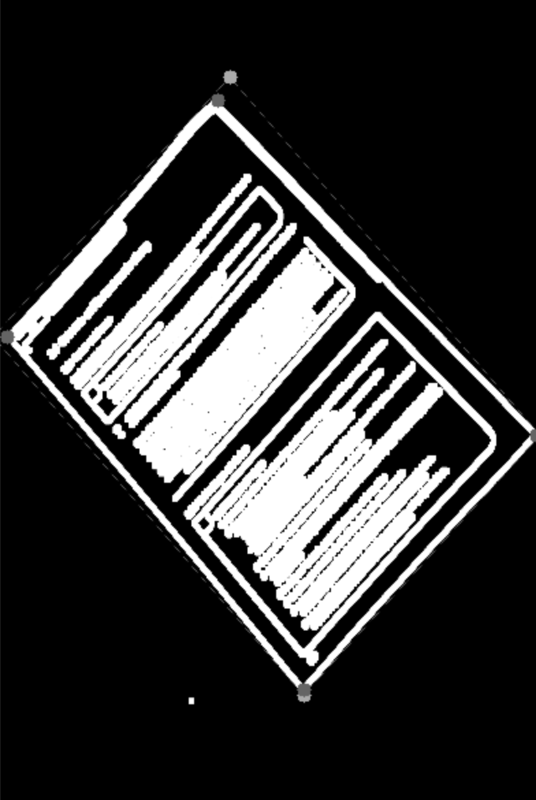

# Installieren and Verwenden

## Installation

Zuerst muss auf dem Lokalen rechner Python (version 3.13.0) installiert werden.
Danach das Projekt.

``` git clone https://github.com/ThomasVockenhuber/DSAI_ImgToDoc.git ```

Nun muss das venv für dieses Projekt verwendet werden. `source venv/bin/activate`
Das Projekt kann nun gestartet werden.

## Verwendung

### Starten

Nachdem das venv verwendet wurde kann man mit dem Befehl `python3 main.py` das Projekt starten. Sollte sich das Fenster nicht gleich öffenen, kann es sein dass man über die Taskleiste darauf zugreifen muss.

### Verwenden

#### Ausschneiden
Nun kann man über die Taste **Open Image** ein Bild ausgewählt werden. Das Programm versucht nun automatisch die Ecken des Dokuments zu erkennen, sollte die erkennung nicht funktioniert haben und der vorgezeichnente Ramen nicht stimmen kann der Ramen auch manuell eingestellt werden. Dazu klick man auf das Bild um den alten Ramen zu löschen und Beginnt bei der oberen linken Ecke die Ecken im Uhrzeigersinn mit einem Mausklick zu makieren.
Ist man nun zufrieden kann man das Dokument mit **Done Cropping** ausscheniden und Auf die Richtige größte vormen. Nun sollte man das Bild in schlechter Qualität in der Vorschau sehen, mit **Undo Cropping** kann man dies Wieder rückgängig machen und den Ramen neu Wählen.
Mit dem Taster **Turn** kann das Dokument im Uhrzeiersinn gedreht werden.

#### Speichern
Sollte die Vorschau passen (Wenn die Vorschau unreinheiten enthällt werden diese meist in den gespeicherten Files entfernt), kann man mit **Save** das Dokument Speichern (Dies kann einige Sekunden dauern) es wird dafür neben dem Spicherort des Bildes ein Ordner mit dem "Namen"_scan erstellt. In diesem werden nun das Dokument als .jpg und .pdf gespeichert.

#### Text Extrahieren
Nachdem das Dokument gespeichert wurde, kann der Text mit der **Extract Text** Taste extrahiert werden. Dieser Text wird als .txt in dem Ordner abgespeichert. Die Sprache ist auf Deutsch eingestellt, deshalb könnte das Programm mit anderen Sprachen probleme haben. Sollte das Dokument viele Vormen haben kann das Programm diese auch fehlerhalt als Text lesen.

> Alle Befehle in diesem Dokument sind für MAC-OS

# Funktionsweise

## Umgebung

## Dokument Scannen
Zuerst wird das Bild in diese Funktion geladen. Hier ist das Beispiel Bild.


Zuerst wird das Bild leicht verschwommen um Rauschen zu entfernen und zu Graustufen umgewandelt.

``` 
gray = cv.cvtColor(image, cv.COLOR_BGR2GRAY)
blured = cv.GaussianBlur(gray, (9, 9), 0) 
```


Nun werded die Ecken erkannt und vergrößert, damit kleine Lücken geschlossen werden.

```
edges = cv.Canny(blured, threshold1=20, threshold2=100)
kernel = np.ones((15, 15), np.uint8)
ecken_vergrößert = cv.dilate(edges, kernel, iterations=2)
```


Hier werden die Hellen stellen des Bildes gefundenn und mit einem Ramen, damit kleine dunkle Flecken wie z.B. Buchstaben auch erkannt werden, Makiert.

```
_,thr_img = cv.threshold(gray, np.mean(gray)-20, 255, cv.THRESH_BINARY)
kernel = np.ones((15, 15), np.uint8)
thr_img = cv.dilate(thr_img, kernel, iterations=4)
```


nun Werden alle Ecken, welche im Dunklen bereich des Bildes sind entfernt.

```
ecken = cv.bitwise_and(ecken_vergrößert, thr_img)
```


Nun werden mögliche rechteckige Konturen des Dokuments gefunden und die, welche die größte Fläche hat wird als die Kontur des Dokuments gewählt.


Nun wird das Bild auf eine kleinere Größe komprimiert, damit der nächste schritt nicht so lange braucht.


Hier werden von den Ecken der Kontur die nächsten Punkte des Papiers gefunden, diese werden schließlich als die Ecken des Dokuments gewählt.



Nun müssen die Ecken wieder auf die Orginalgrößre angepasst werden.


### Eckenerkennung

### Artefakte Entfernen

## Text Extrahieren